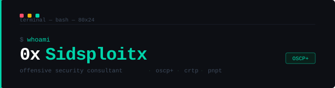

 # 0xSidsploitx

🔗 **[Blog](https://sidesploitx.github.io/0xSidsploitx)** 

---

## Work

Penetration testing and GRC compliance consulting. Engagements cover web applications, internal networks, Active Directory, APIs, and infrastructure — with compliance assessments against PCI-DSS, ISO 27001, PISF, PEMRA, and nCERT frameworks.

Actively researches and responsibly discloses vulnerabilities in widely-used security tools. All findings are coordinated directly with vendors prior to any publication.

---

## Tools

| Tool | Description |
|---|---|
| `phantom.sh` | Single-target recon pipeline — port scan, service fingerprint, HTTP probe, subdomain enum |
| `phantom_swarm.sh` | Multi-target variant for internal network assessments, parallel execution across host lists |
| `Pentest-Swarm-AI` | AI-assisted agent framework — LLM-powered attack chain suggestions from recon output |

---

## Skills

**Offensive** — Web application testing · API security (REST/GraphQL/JWT) · Active Directory attacks (Kerberoasting, Pass-the-Hash, BloodHound, DCSync) · Network penetration testing · C2 operations (Covenant) · Custom tooling in Python, PowerShell, Bash

**GRC** — PCI-DSS · ISO 27001 · PISF · PEMRA · nCERT · SBP Cybersecurity Directives

**Tools** — Burp Suite · Nmap · RustScan · Nessus · Nuclei · BloodHound · Mimikatz · Impacket · Rubeus · CrackMapExec · sqlmap · ffuf · Covenant · Metasploit

---

## Writing

Security research, methodology breakdowns, and tooling notes at **[sidesploitx.github.io/0xSidsploitx](https://sidesploitx.github.io/0xSidsploitx)**

---

## Certifications

<table>
  <tr>
    <td align="center" width="180">
      
       
      <b>OSCP+</b>
       
      Offensive Security
    </td>
    <td align="center" width="180">
      
       
      <b>CRTP</b>
       
      Altered Security
    </td>
    <td align="center" width="180">
      
       
      <b>PNPT</b>
       
      TCM Security
    </td>
  </tr>
</table>

---

Offensive Security Research · Penetration Testing · Vulnerability Disclosure
